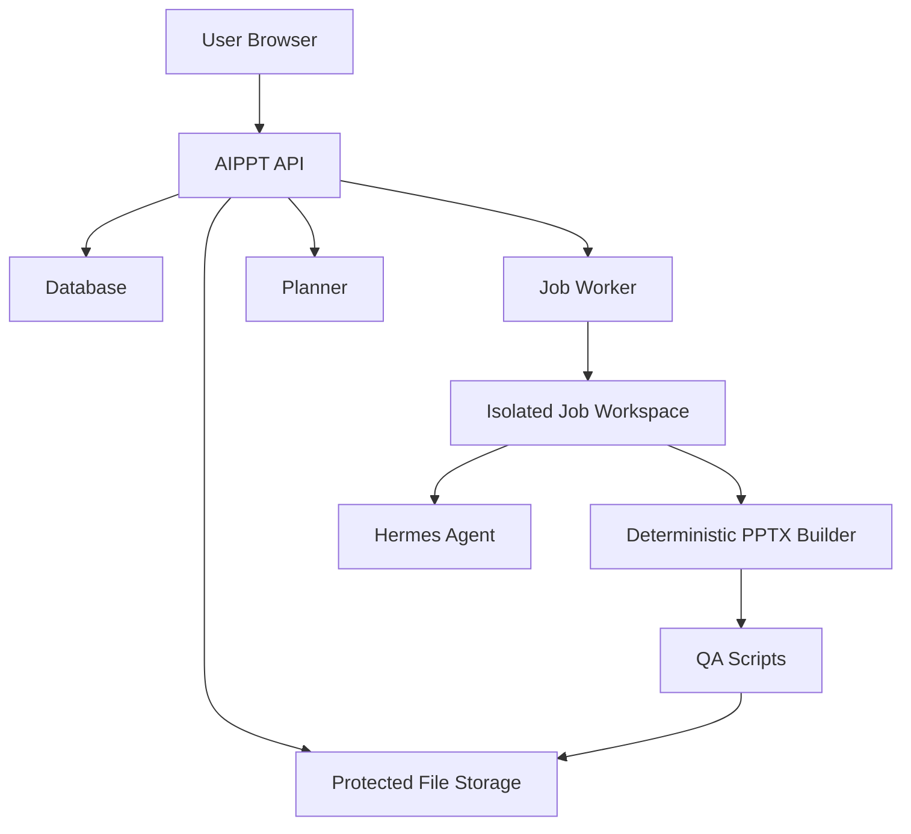

# AIPPT Architecture



## Ownership Boundary

The API is the authority for identity and authorization. The worker and Hermes
never decide whether a user can see a deck or file.

## Core Entities

```text
User
DeckSession
Job
FileAsset
```

Each entity exposed to a user has `owner_user_id`.

## API Rule

All resource reads follow this shape:

```sql
where id = :resource_id
  and owner_user_id = :current_user_id
```

No route should fetch a deck, job, or file by id alone.

## Hermes Role

Hermes is a bounded worker component:

- Reads sanitized input and Deck IR.
- Fixes Deck IR when validation fails.
- Invokes whitelisted scripts.
- Writes logs and error reports.

Hermes does not:

- Authenticate users.
- Read global project state.
- Install dependencies in job workspaces.
- Decide final PPTX geometry.

## Job Workspace

Each job gets a private workspace:

```text
/srv/aippt/jobs/{owner_user_id}/{job_id}/
  AGENTS.md
  manifest.json
  input/outline.md
  ir/deck.json
  out/deck.pptx
  logs/job.log
```

The raw workspace path is internal worker state. Browser clients receive job
ids and authenticated artifact endpoints, not filesystem paths.
