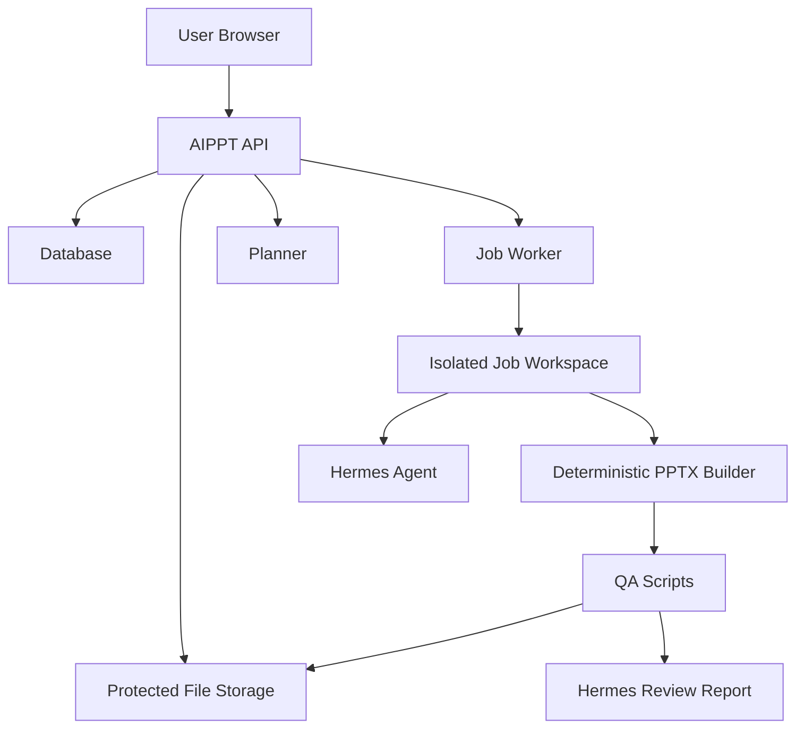

# AIPPT Architecture



## Ownership Boundary

The API is the authority for identity and authorization. The worker and Hermes
never decide whether a user can see a deck or file.

## Core Entities

```text
User
DeckSession
Job
FileAsset
```

Each entity exposed to a user has `owner_user_id`.

## API Rule

All resource reads follow this shape:

```sql
where id = :resource_id
  and owner_user_id = :current_user_id
```

No route should fetch a deck, job, or file by id alone.

## Hermes Role

Hermes is a bounded worker component:

- Reads sanitized input and Deck IR.
- Fixes Deck IR when validation fails.
- Invokes whitelisted scripts.
- Writes logs and error reports.

Hermes does not:

- Authenticate users.
- Read global project state.
- Install dependencies in job workspaces.
- Decide final PPTX geometry.

## Job Workspace

Each job gets a private workspace:

```text
/srv/aippt/jobs/{owner_user_id}/{job_id}/
  AGENTS.md
  manifest.json
  input/outline.md
  ir/deck.json
  out/deck.pptx
  logs/job.log
```

The raw workspace path is internal worker state. Browser clients receive job
ids and authenticated artifact endpoints, not filesystem paths.

## Worker Loop

The first worker loop is deterministic:

1. Claim one queued `build_pptx` job.
2. Read `input/outline.md`.
3. Generate constrained Deck IR at `ir/deck.json`.
4. Run the PPTX builder and write `out/deck.pptx`.
5. Record internal `FileAsset` rows for IR, PPTX, and logs.
6. Mark the job and deck `ready` or `failed`.

Hermes should enter this loop later as a repair/planning component, not as the
owner of authorization, artifact storage, or final filesystem layout.

## Review Loop

`hermes_review` is a non-destructive job type. It creates a fresh workspace,
reads the current outline plus latest Deck IR/PPTX file assets for the deck, and
writes:

```text
qa/qa.json
logs/hermes_review.md
```

The report is recorded as a `review` file asset and can be downloaded by the
deck owner. A review job does not move a ready deck back to `generating`, and a
review failure does not mark the PPTX artifact as failed. This keeps Hermes'
review path safe while the production builder remains the source of accepted
PPTX output.
